# 🌐 Proyecto de Topología de Red con Packet Tracer 

## Descripción

Este proyecto tiene como objetivo diseñar e implementar una topología de red segura que conecta cinco sedes con acceso a una red WAN. El diseño incluye configuraciones avanzadas como ACL, servicios de red (DHCP, web, FTP, email, DNS), y una topología de Routing on a Stick con subinterfaces. Además, se implementan protocolos de autenticación PAP y CHAP para asegurar las conexiones.

    Sede Lima:
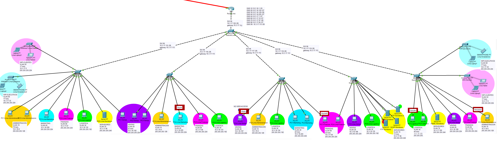

## Requisitos

- **Software:** Cisco Packet Tracer
- **Conocimientos Previos:** 
  - Configuración de routers y switches en Packet Tracer.
  - Implementación de listas de control de acceso (ACL).
  - Configuración de servicios de red como DHCP, DNS, y FTP.
  - Conocimientos básicos de routing y subinterfaces.

## Instrucciones de Uso

1. **Abrir Packet Tracer:** 
   - Asegúrate de tener instalada la versión compatible de Cisco Packet Tracer(8.2.2).
2. **Cargar Configuraciones:**
   - Abre cada archivo `.pkt` en Packet Tracer para visualizar y editar la configuración de cada sede.
3. **Verificar Conectividad:**
   - Comprueba la conectividad entre sedes y hacia la WAN utilizando comandos de ping o el uso de PDU.
   -     Ping: Dispositivo/Desktop/Command Prompt
       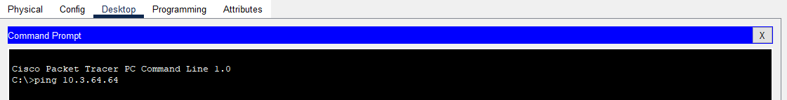
   -     PDU: Click en el icono/CLick en un dispositivo de inicio y final
        
4. **Pruebas de Servicios:**
   - Asegúrate de que los servicios de red (DHCP, web, FTP, email, DNS) están funcionando correctamente.
   -     DNS: Servidor DNS/Services/DNS
         🔵 Dominio email
         🔴 Dominio web
        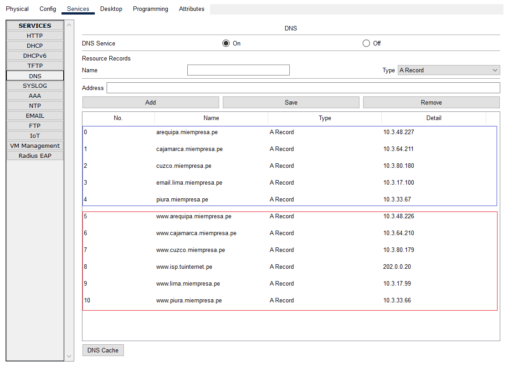
   -     Web: Dispositivo/Desktop/Web Browser
         🔴 Dominio web
        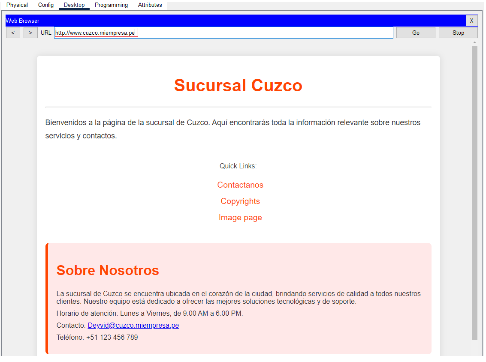 
   -     Email: Dispositivo marcado/Desktop/Mail
         🟢 Dispositivo marcado
         ❌ Dispositivo NO marcado
       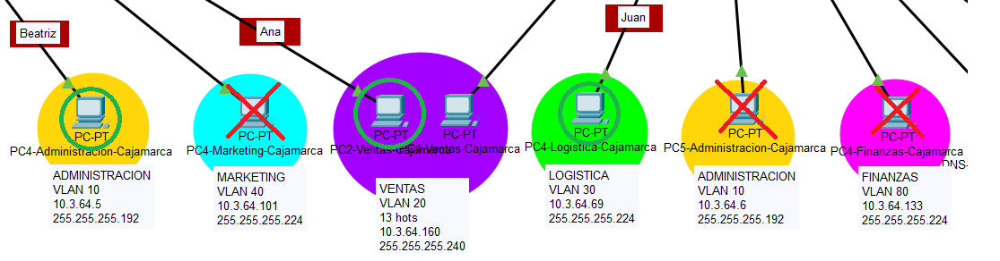

       Paso 1: Completa los datos del dispositivo marcado y da clic en enviar.
        
       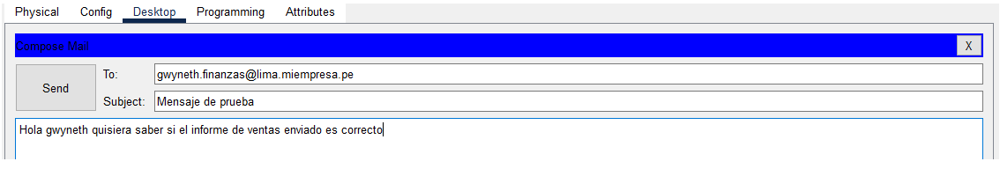 

       Paso 2: Verifica el envio del mensaje en la parte inferior

       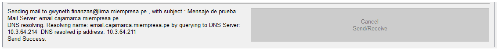

       Paso 3: Verifica que se recibio el mensaje en el correo del dispositivo receptor
    
       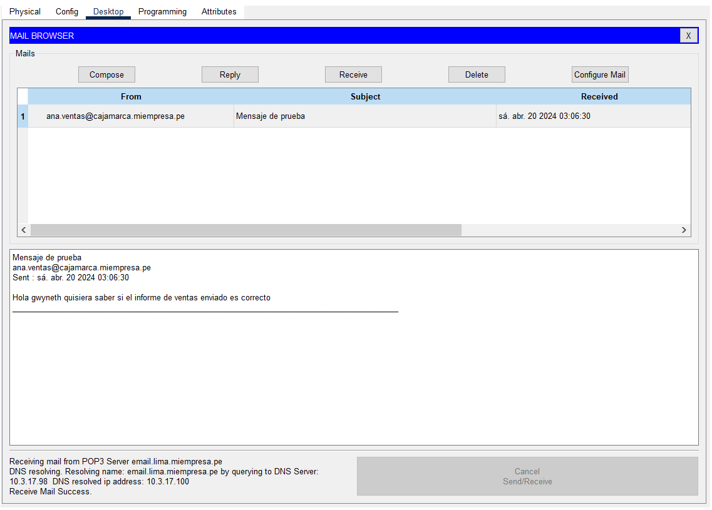
        
   -     DHCP: Configuración DHCP en el router para los access point
       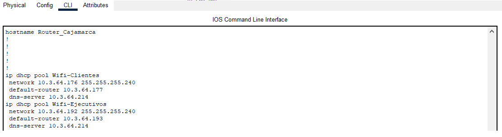
       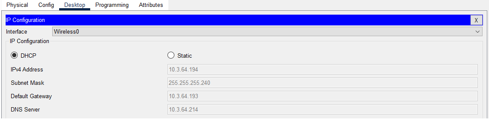

   -     DHCP: Servidor DHCP/Services/DHCP
       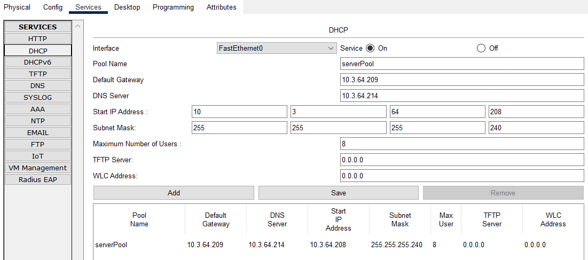
       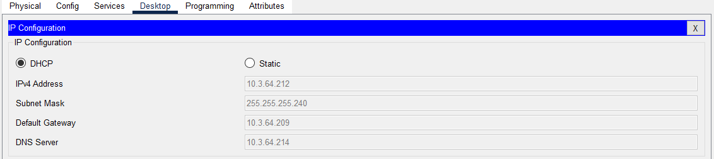

   -     FTP: Servidor FTP/Services/FTP
       
   -     FTP: Dispositivo/Desktop/Command Prompt
       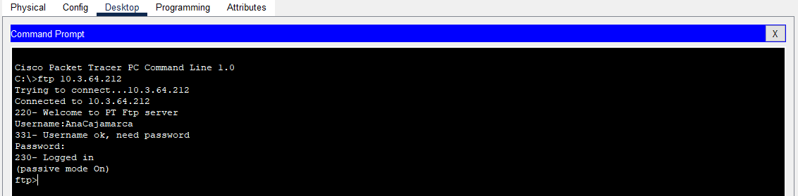   
       
5. **Simulación de Tráfico:**
   - Se implementaron 5 ACL con la siguientes finalidades:
   -    Sede Lima
   
            - Crear una ACL la cual permita todo tráfico FTP de toda sucursal Lima. Además, denegar el tráfico 
            FTP desde cualquier otra sucursal hacia el servidor 10.3.17.103 y permitir todo el tráfico IP restante.
        
            - Crear una ACL para bloquear el tráfico HTTP saliente desde el host 10.3.16.197. Además, permitir todo 
            tipo de tráfico IP.        
   -    Sede Piura

            Crear una ACL la cual permita todo tráfico FTP de toda sucursal Piura. Además, denegar el tráfico FTP 
            desde cualquier otra sucursal hacia el servidor 10.3.33.71 y permitir todo el tráfico IP restante.
        
   -    Sede Cuzco
        
            Crear una ACL la cual permita todo tráfico FTP de toda sucursal Cuzco. Además, denegar el tráfico FTP 
            desde cualquier otra sucursal hacia el servidor 10.3.80.182 y permitir todo el tráfico IP restante.
        
   -    Sede Cajamarca
        
            Crear una ACL la cual permita todo tráfico FTP de toda sucursal Cajamarca. Además, denegar el tráfico FTP 
            desde cualquier otra sucursal hacia el servidor 10.3.17.212 y permitir todo el tráfico IP restante.
        
   -    Sede Arequipa
        
            Crear una ACL la cual permita todo tráfico FTP de toda sucursal Arequipa. Además, denegar el tráfico FTP 
            desde cualquier otra sucursal hacia el servidor 10.3.17.103 y permitir todo el tráfico IP restante.

## Características

- **Número de Sedes:** 5
- **Acceso WAN:** Configuración de una red segura con acceso a Internet.
- **Protocolos de Seguridad:**
  - **ACL:** Listas de control de acceso configuradas para controlar el tráfico.
  - **PAP/CHAP:** Protocolos de autenticación para conexiones seguras.
- **Servicios Configurados:**
  - **DHCP:** Asignación automática de direcciones IP.
  - **Web, FTP, Email, DNS:** Servicios básicos de red implementados y configurados.
- **Topología:**
  - **Routing on a Stick:** Configuración de enrutamiento con subinterfaces.
  - **Trunk:** Configuración de enlaces troncales (trunking) entre switches para permitir el tráfico de múltiples VLANs.
  - **SVI (Switch Virtual Interfaces):** Implementación de interfaces virtuales para la gestión de VLANs.
  - **Rutas:** Implementación de enrutamiento RIP y rutas estáticas por     default.
- **VLANs Configuradas:**
  - **VLAN 10, 20, 30, 40, 50, 60, 70, 80:** VLANs configuradas para segmentar la red.
  - **VLAN 90:** VLAN dedicada para la gestión de la red.

## Resultados

- **Seguridad:** La red asegura la autenticación y acceso controlado mediante ACL y protocolos PAP/CHAP.
- **Conectividad:** Todas las sedes están conectadas de manera eficiente con acceso seguro a la red WAN.
- **Servicios:** Los servicios de red están configurados y operativos según las especificaciones del proyecto.
- **Segmentación:** La segmentación de la red mediante VLANs y enlaces troncales asegura una correcta administración y separación del tráfico.

## Autores

- 🌞 Deyvid Joseph Guevara Cueva
- 🌞 Gwyneth Gisele Lyu Segura Silva
- 🌞 Alexandra Dayanna Ramirez Díaz
- 🌞 Raul Gonzalo Pingo Amaya
- 🌞 Alvaro Alison Patricio Acuña